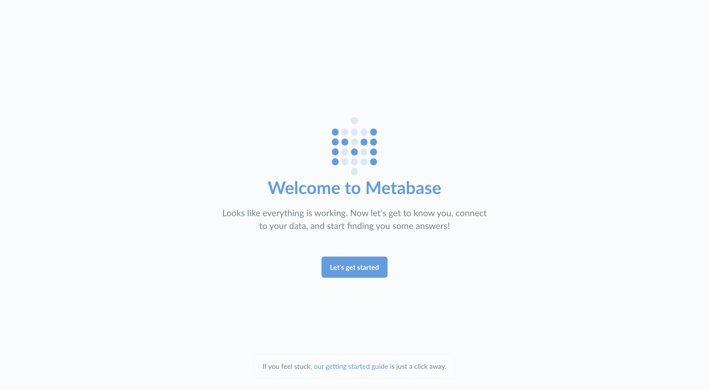
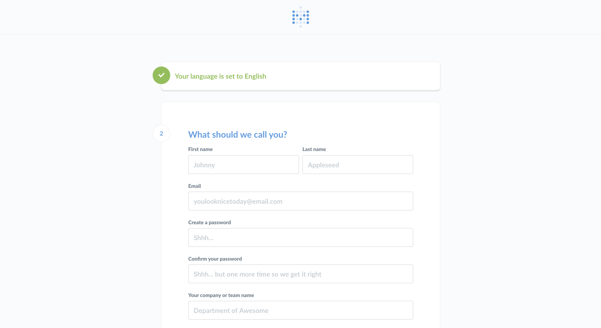
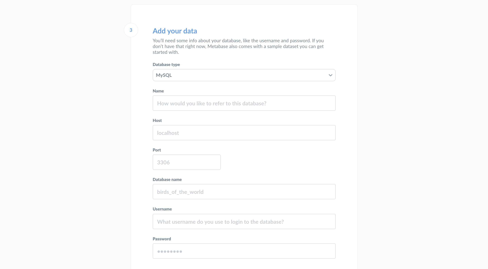
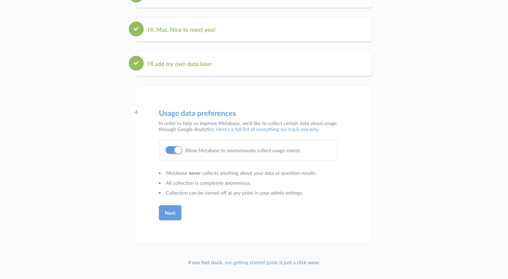
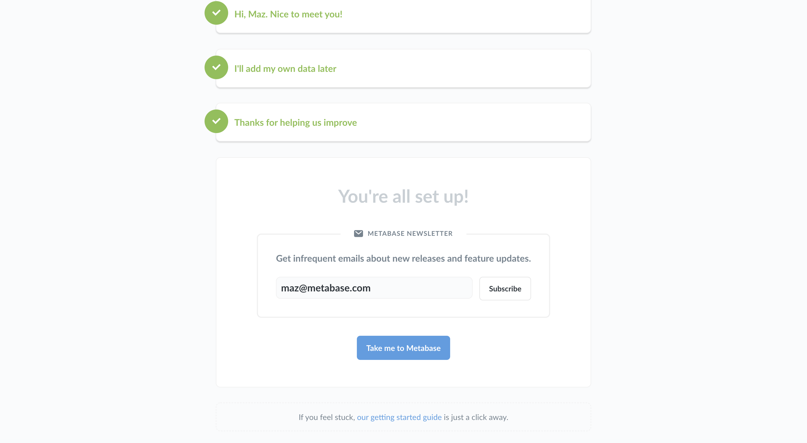

# Setting up Dashboard
This guide will help you set up Dashboard once you’ve gotten it installed. If you haven’t installed Dashboard yet, you can [get Dashboard here](https://metabase.com/start).

Start Dashboard up for the first time and you’ll see this screen:

Go ahead and click **Let’s get started**.

## Setting up an admin account
The first thing you’ll need to do is set up an admin account. The account you create when you first install Dashboard is an admin account by default — handy! If you’ve installed Dashboard on a production server, you should be really careful to remember the password for this account since it will be used to add other users, connect to databases, set up email, and more. You can also create additional admin accounts later.

For now, let's just create an account for ourselves to explore Dashboard. Type in your info, and when you’re ready to continue, click the **Next** button.

## Gathering your database info
At this point you’ll need to gather some information about the database you want to use with Dashboard. We won’t be able to connect to your database without it, but you’d like to deal with all of this later, that’s okay: just click **I’ll add my data later**. Dashboard comes with a [Sample Database](https://www.metabase.com/glossary/sample_database) that you can play around with to get a feel for how Dashboard works.

If you’re ready to connect, here’s what you’ll need:

* The **hostname** of the server where your database lives
* The **port** the database server uses
* The **database name**
* The **username** you use for the database
* The **password** you use for the database

If you don't have this information handy, the person responsible for administering the database should have it.

## Connect to your database

Now that you have your database info you can connect to your database. Sweet, sweet data at last. Just go ahead and put your info into this form and click **Next**.

For more on connecting to databases, see [Adding and managing databases](../databases/connecting.md).

## Usage data preferences

One last quick thing that you’ll have to decide is if it’s okay for us to collect some anonymous info about how you use the product — it helps us make Dashboard better. Like the box says:
* Dashboard never collects anything about your data or question results.
* All collection is completely anonymous.
* Collection can be turned off at any point in your admin settings.

If you’re ready to start using Dashboard, go ahead and click **Next**.

## Staying in touch
At this point you are all set and ready to use Dashboard.  Since we like keeping in touch with our friends we made it easy to sign up for our newsletter (infrequent emails) with a single click!

Once you're done here simply follow the link to **Take me to Dashboard**.  And if you decided to skip the newsletter sign-up, it's cool, we still like you :)

## Getting started with Dashboard

For a tutorial on getting up and running with questions and dashboards, head over to [Learn Dashboard](https://www.metabase.com/learn/getting-started/getting-started.html).

***

If you’d like more technical resources to set up your data stack with Dashboard, connect with a [Dashboard Expert](https://www.metabase.com/partners/){:target="_blank"}.

