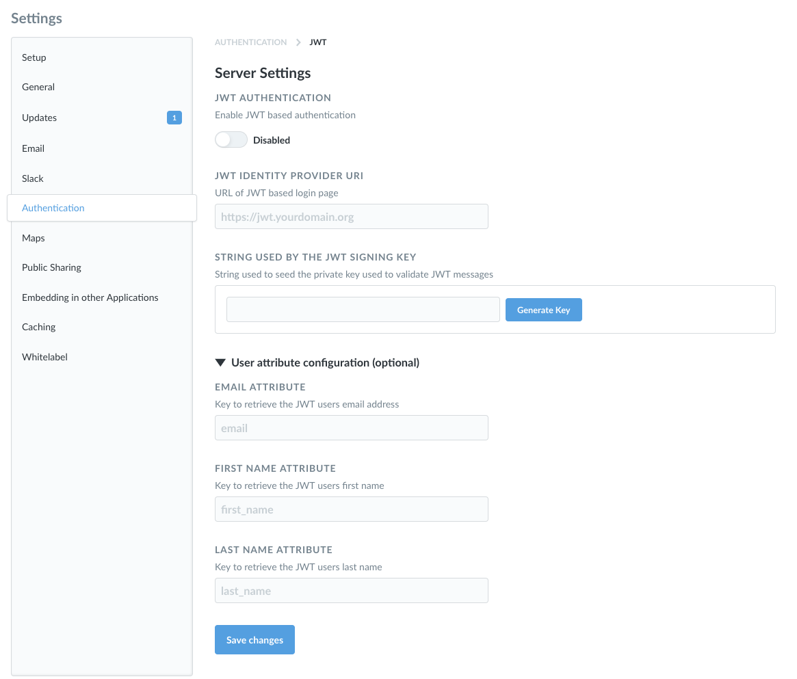

# JWT-based authentication



You can connect Dashboard to your identity provider using JSON Web Tokens (JWT) to authenticate people.

## Authentication flows

Dashboard supports two auth flows that can be used with JWT:

- Authorization Code Flow
- Authorization Code Flow with PKCE

Dashboard's auth flows are custom workflows modelled after OAuth 2.0. You can use the auth flow with PKCE to incorporate random keys generated on demand.

Currently, the only algorithm Dashboard supports is [HS256](https://en.wikipedia.org/wiki/JSON_Web_Token) ([HMAC](https://en.wikipedia.org/wiki/HMAC) + [SHA-256](https://en.wikipedia.org/wiki/SHA-2)).

## Typical flow for a JWT-based SSO interaction with Dashboard

Assuming your site is localhost serving on port 3000:

1. Person attempts to view a question, e.g., `http://localhost:3000/question/1-superb-question`.
2. If the person isn't logged in, Dashboard redirects them to `http://localhost:3000/auth/sso/`.
3. Retaining the original `/question/1-superb-question` URI, Dashboard redirects the person to the SSO provider (the authentication app).
4. Person logs in using the basic form.
5. In the event of a successful sign-in, your authentication app should issue a GET request to your Dashboard endpoint with the token and the "return to" URI: `http://localhost:3000/auth/sso?jwt=TOKEN_GOES_HERE&return_to=/question/1-superb-question`.
6. Dashboard verifies the JSON Web Token, logs the person in, then redirects the person to their original destination, `/question/1-superb-question`.

## Enabling JWT authentication

Navigate to the **Admin**>**Settings** section of the Admin area, then click on the **Authentication** tab. Click the **Configure** button in the JWT section of this page, and you'll see this form:

Click the toggle at the top of the form to enable JWT-based authentication. **Make sure to set the toggle to Enabled**, otherwise JWT authentication won't work, even if all of your other settings are correct.

Here's a breakdown of each of the settings:

**JWT Identity Provider URI:** This is where Dashboard will redirect login requests. That is, it's where your users go to log in through your identity provider.

**String Used by the JWT Signing Key:** The string used to seed the private key used to validate JWT messages. Both Dashboard and the authentication app should have the same JWT signing key.

## User attribute configuration (optional)

These are additional settings you can fill in to pass user attributes to Dashboard.

- **Email attribute:** the key to retrieve each JWT user's email address.
- **First Name attribute:** the key to retrieve each JWT user's first name.
- **Last Name attribute:** if you guessed that this is the key to retrieve each JWT user's last name, well then you have been paying attention.

You can send additional user attributes to Dashboard by adding the attributes as key/value pairs to your JWT. These attributes will be synced on every login.

## Group schema

You can use your JWT to assign Dashboard users to custom groups by following these steps:

1. Add this to your JWT: `groups: ["group_name"]`
2. In the Admin Panel in Dashboard, go to the Authentication tab of the Settings section and click the Configure button on JWT. On this screen, turn on the toggle under "SYNCHRONIZE GROUP MEMBERSHIPS".
3. Next, click Edit Mappings. In this modal, type in the name of one of your groups as defined in the JWT, then click Add. In the row that appears, click the dropdown to pick the Dashboard group that this should map to. Repeat this for each of the groups you want to map.

## Creating Dashboard accounts with SSO

> Paid plans [charge for each additional account](https://www.metabase.com/docs/latest/cloud/how-billing-works#what-counts-as-a-user-account).

A new SSO login will automatically create a new Dashboard account.

Dashboard accounts created with an external identity provider login don't have passwords. People who sign up for Dashboard using an IdP must continue to use the IdP to log into Dashboard.

## Disabling password logins

> **Avoid locking yourself out of your Dashboard!** This setting will apply to all Dashboard accounts, _including your Dashboard admin account_. We recommend that you keep password authentication **enabled**. This will safeguard you from getting locked out of Dashboard in case of any problems with SSO.

To require people to log in with SSO, disable password authentication from **Admin settings** > **Authentication**.

## Note about Azure

If you're using Azure, you may need to use Azure AD B2C. Check out their [tokens overview](https://docs.microsoft.com/en-us/azure/active-directory-b2c/tokens-overview).

## Example code using JWT-based authentication

You can find example code that uses JWT authentication in the [SSO examples repository](https://github.com/metabase/sso-examples).

- [JWT example in a Clojure app](https://github.com/metabase/sso-examples/tree/master/clj-jwt-example)
- [JWT example in JavaScript (Node) app](https://github.com/metabase/sso-examples/tree/master/nodejs-jwt-example)
